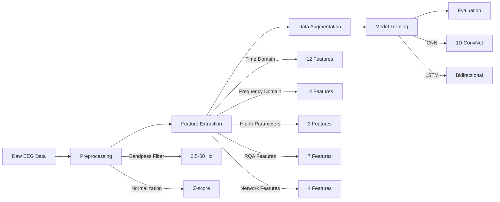

<p align="center">
  
  
  
  
</p>

<h1 align="center">🧠 EEG Classification for Epileptic Seizure Detection</h1>

<p align="center">
  <em>Deep Learning approach to classify EEG signals for automated epilepsy diagnosis</em>
</p>

<p align="center">
  
  
  
</p>

---

## 📋 Table of Contents

- [Overview](#-overview)
- [Dataset](#-dataset)
- [Project Architecture](#-project-architecture)
- [Features Extracted](#-features-extracted)
- [Models](#-models)
- [Results](#-results)
- [Installation](#-installation)
- [Usage](#-usage)
- [Project Structure](#-project-structure)
- [Future Work](#-future-work)
- [References](#-references)
- [Author](#-author)

---

## 🎯 Overview

Epilepsy affects approximately **50 million people** worldwide, making it one of the most common neurological diseases globally. This project develops a **deep learning classification system** to automatically detect epileptic seizures from EEG (Electroencephalogram) signals.

### Key Highlights

```
┌─────────────────────────────────────────────────────────────────┐
│  ⚡ 94.67% Test Accuracy using 1D CNN                           │
│  📊 40 handcrafted features (Time, Frequency, RQA, Network)     │
│  🔄 5 Data Augmentation techniques for robust training          │
│  🧬 Multi-class classification (5 EEG states)                   │
└─────────────────────────────────────────────────────────────────┘
```

---

## 📊 Dataset

This project uses the **Bonn EEG Dataset**, a benchmark dataset in epilepsy research.

| Set | Description | Category | Samples |
|:---:|:------------|:---------|:-------:|
| **Z** | Healthy volunteers - Eyes Open | Normal | 100 |
| **O** | Healthy volunteers - Eyes Closed | Normal | 100 |
| **N** | Epileptic patients - Hippocampal formation (seizure-free) | Interictal | 100 |
| **F** | Epileptic patients - Epileptogenic zone (seizure-free) | Interictal | 100 |
| **S** | Epileptic patients - Seizure activity | Ictal | 100 |

### Signal Properties

```
📈 Sampling Frequency: 173.61 Hz
⏱️  Recording Duration: 23.6 seconds per sample
📍 Data Points: 4,097 per recording
📁 Total Samples: 500
```

<p align="center">
  
</p>

---

## 🏗️ Project Architecture



---

## 🔬 Features Extracted

### Time-Domain Features (12)
| Feature | Description |
|---------|-------------|
| Mean, Std, Variance | Statistical moments |
| Min, Max, Peak-to-Peak | Range statistics |
| Skewness, Kurtosis | Distribution shape |
| RMS, Zero Crossings | Signal characteristics |
| Mean Abs Diff, Line Length | Signal complexity |

### Frequency-Domain Features (14)
| Band | Frequency Range | Clinical Significance |
|------|-----------------|----------------------|
| **Delta (δ)** | 0.5-4 Hz | Deep sleep, brain injuries |
| **Theta (θ)** | 4-8 Hz | Drowsiness, meditation |
| **Alpha (α)** | 8-13 Hz | Relaxed, eyes closed |
| **Beta (β)** | 13-30 Hz | Active thinking, focus |
| **Gamma (γ)** | 30-50 Hz | Cognitive functioning |

### Advanced Features
- **Hjorth Parameters**: Activity, Mobility, Complexity
- **RQA Features**: Recurrence Rate, Determinism, Laminarity, Entropy
- **Network Features**: Average Degree, Density, Clustering Coefficient, Transitivity

---

## 🤖 Models

### 1D Convolutional Neural Network (CNN) 🏆

```
┌──────────────────────────────────────────────────────────────┐
│  Input (4097, 1)                                              │
│     ↓                                                         │
│  Conv1D(32, 7) → BatchNorm → MaxPool(4) → Dropout(0.2)       │
│     ↓                                                         │
│  Conv1D(64, 5) → BatchNorm → MaxPool(4) → Dropout(0.25)      │
│     ↓                                                         │
│  Conv1D(128, 3) → BatchNorm → MaxPool(4) → Dropout(0.3)      │
│     ↓                                                         │
│  Conv1D(256, 3) → BatchNorm → GlobalAvgPool                   │
│     ↓                                                         │
│  Dense(128) → BatchNorm → Dropout(0.4)                        │
│     ↓                                                         │
│  Dense(64) → Dropout(0.3)                                     │
│     ↓                                                         │
│  Dense(5, softmax)                                            │
└──────────────────────────────────────────────────────────────┘
```

### Bidirectional LSTM

```
┌──────────────────────────────────────────────────────────────┐
│  Input (256, 1) - Downsampled                                 │
│     ↓                                                         │
│  BiLSTM(64) → BatchNorm → Dropout(0.25)                       │
│     ↓                                                         │
│  BiLSTM(32) → BatchNorm → Dropout(0.25)                       │
│     ↓                                                         │
│  BiLSTM(16) → BatchNorm → Dropout(0.3)                        │
│     ↓                                                         │
│  Dense(64) → BatchNorm → Dropout(0.3)                         │
│     ↓                                                         │
│  Dense(32) → Dropout(0.2)                                     │
│     ↓                                                         │
│  Dense(5, softmax)                                            │
└──────────────────────────────────────────────────────────────┘
```

---

## 📈 Results

### Performance Comparison

| Model | Accuracy | Precision | Recall | F1-Score | AUC |
|:-----:|:--------:|:---------:|:------:|:--------:|:---:|
| **CNN** 🏆 | **94.67%** | **95.42%** | **94.67%** | **0.946** | **0.980** |
| LSTM | 52.00% | 52.99% | 52.00% | 0.515 | 0.879 |

### Per-Class Performance (CNN)

| Class | Precision | Recall | F1-Score |
|:-----:|:---------:|:------:|:--------:|
| Z (Normal - Eyes Open) | 1.00 | 0.93 | 0.97 |
| O (Normal - Eyes Closed) | 0.94 | 1.00 | 0.97 |
| N (Interictal - Hippocampal) | 0.83 | 1.00 | 0.91 |
| F (Interictal - Epileptogenic) | 1.00 | 0.80 | 0.89 |
| S (Seizure) | 1.00 | 1.00 | 1.00 |

### Confusion Matrix

```
              Predicted
            Z    O    N    F    S
         ┌────┬────┬────┬────┬────┐
       Z │ 14 │  1 │  0 │  0 │  0 │
         ├────┼────┼────┼────┼────┤
       O │  0 │ 15 │  0 │  0 │  0 │
True     ├────┼────┼────┼────┼────┤
       N │  0 │  0 │ 15 │  0 │  0 │
         ├────┼────┼────┼────┼────┤
       F │  0 │  0 │  3 │ 12 │  0 │
         ├────┼────┼────┼────┼────┤
       S │  0 │  0 │  0 │  0 │ 15 │
         └────┴────┴────┴────┴────┘
```

### Key Findings

```
✅ Seizure detection (Class S) achieves 100% recall - critical for clinical application
✅ CNN significantly outperforms LSTM for this task
✅ Data augmentation improved model generalization
✅ Interictal states (N, F) are most challenging to distinguish
```

---

## 🚀 Installation

### Prerequisites

- Python 3.8 or higher
- pip package manager

### Setup

```bash
# Clone the repository
git clone https://github.com/rajivpraveen/eeg-seizure-detection.git
cd eeg-seizure-detection

# Create virtual environment (recommended)
python -m venv venv
source venv/bin/activate  # On Windows: venv\Scripts\activate

# Install dependencies
pip install -r requirements.txt
```

---

## 💻 Usage

### Running the Notebook

```bash
jupyter notebook eeg_seizure_detection.ipynb
```

### Quick Start

```python
# Load and preprocess data
from preprocessing import load_eeg_data, preprocess_eeg

raw_data, labels = load_eeg_data("Bonn Dataset")
preprocessed_data = preprocess_eeg(raw_data)

# Extract features
from features import extract_all_features
features = [extract_all_features(signal) for signal in preprocessed_data]

# Train model
from models import build_cnn_model
model = build_cnn_model(input_shape=(4097, 1))
model.fit(X_train, y_train, epochs=100)
```

---

## 📁 Project Structure

```
eeg-seizure-detection/
│
├── 📓 eeg_seizure_detection.ipynb          # Main notebook with complete pipeline
├── 📄 project_report.pdf                   # Project documentation/report
│
├── 📂 Bonn Dataset/                        # EEG data (not included - download separately)
│   ├── Z/                                  # Healthy - Eyes Open
│   ├── O/                                  # Healthy - Eyes Closed
│   ├── N/                                  # Interictal - Hippocampal
│   ├── F/                                  # Interictal - Epileptogenic
│   └── S/                                  # Seizure Activity
│
├── 📄 requirements.txt                     # Python dependencies
├── 📄 README.md                            # Project documentation
├── 📄 LICENSE                              # MIT License
└── 📄 .gitignore                           # Git ignore file
```

---

## 🔮 Future Work

- [ ] Implement attention mechanisms for improved interpretability
- [ ] Add real-time seizure prediction capabilities  
- [ ] Explore transfer learning from larger EEG datasets
- [ ] Deploy as a web application for clinical use
- [ ] Implement cross-patient validation

---

## 📚 References

1. Andrzejak, R.G., et al. (2001). "Indications of nonlinear deterministic and finite-dimensional structures in time series of brain electrical activity"
2. LeCun, Y., et al. (2015). "Deep learning." Nature
3. Hochreiter, S., & Schmidhuber, J. (1997). "Long short-term memory." Neural computation

---

## 👨‍💻 Author

<p align="center">
  <strong>Rajiv Praveen</strong><br>
  <em>Northeastern University</em><br>
  <em>IE 6400 - Foundations of Data Analytics</em>
</p>

<p align="center">
  <a href="https://linkedin.com/in/rajivpraveen">
    
  </a>
  <a href="https://github.com/rajivpraveen">
    
  </a>
</p>

---

<p align="center">
  <strong>⭐ Star this repository if you found it helpful!</strong>
</p>

<p align="center">
  Made with ❤️ at Northeastern University
</p>

